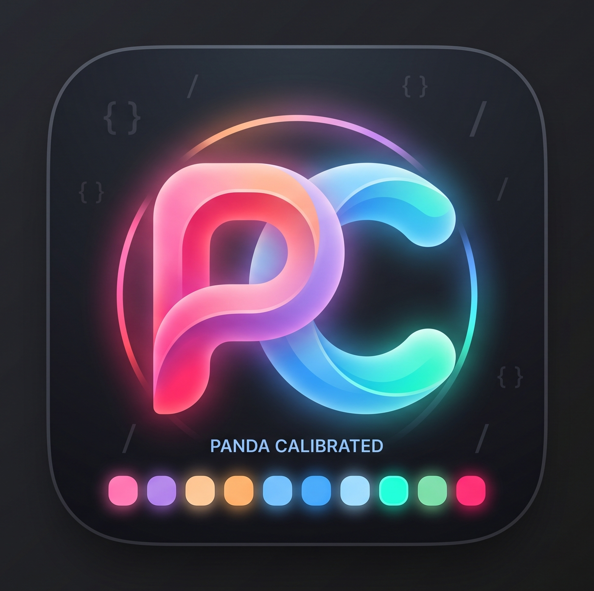
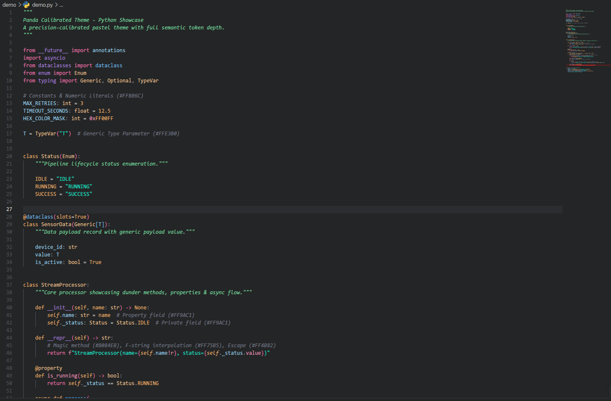
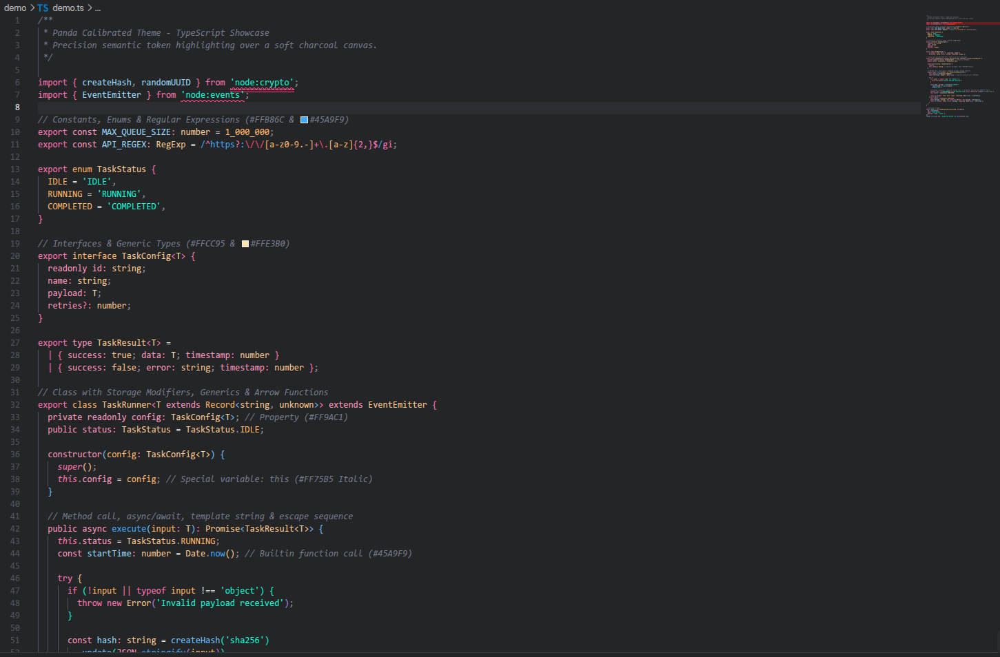

# Panda Calibrated Dark Theme

<div align="center">
  
  <p><strong>A precision-calibrated evolution of Panda Syntax with complete LSP semantic token coverage.</strong></p>
  <p>
    <a href="https://marketplace.visualstudio.com/items?itemName=mhabrar.panda-calibrated"></a>
    <a href="https://open-vsx.org/extension/mhabrar/panda-calibrated"></a>
    <a href="LICENSE"></a>
    <a href="https://github.com/MahirHamiAbrar/panda-calibrated"></a>
  </p>
</div>

---

## Visuals

<div align="center" style="display: flex; flex-wrap: wrap; justify-content: center; gap: 16px;">
  <div style="flex: 1 1 320px; max-width: 580px; min-width: 280px; display: inline-block; vertical-align: top; margin: 8px;">
    <h3>Python</h3>
    
  </div>
  <div style="flex: 1 1 320px; max-width: 580px; min-width: 280px; display: inline-block; vertical-align: top; margin: 8px;">
    <h3>TypeScript</h3>
    
  </div>
</div>

---

## Color Palette

| Swatch | Color Name | Hex Code | Visual Role in Code |
| :---: | :--- | :--- | :--- |
| ⬛ | **Panda Canvas** | `#242526` | Main editor background |
| ⬛ | **Panda Trench** | `#202122` | Sidebars, gutters, activity bar |
| ⬛ | **Selection** | `#373B41` | Word & line selections |
| 🌸 | **Neon Blossom** | `#FF75B5` | Control keywords (`from`, `import`, `if`, `await`, `yield`) |
| 🪻 | **Panda Lavender** | `#B084EB` | Modules, packages, namespaces (`contextlib`, `fastapi`) |
| 🍑 | **Golden Peach** | `#FFCC95` | Classes, interfaces, type annotations (`FastAPI`, `AsyncIterator`) |
| 🍊 | **Warm Apricot** | `#FFB86C` | Function parameters, kwargs (`title=`), numbers, constants |
| 🐬 | **Panda Sky Blue** | `#6FC1FF` | Function declarations, free function calls (`init_db()`) |
| ⚡ | **Electric Cerulean**| `#45A9F9` | Method calls (`app.mount()`, `logger.info()`), builtins |
| 🧊 | **Panda Ice Blue** | `#9CDCFE` | Variables, routers (`file_router`), instances, call arguments |
| 🌷 | **Soft Rose** | `#FF9AC1` | Object properties (`.lifespan`), storage modifiers (`const`) |
| 🌿 | **Neon Mint** | `#19F9D8` | Strings, markdown headings, git added lines |
| 🍃 | **Sage Mint** | `#7BE6A9` | Multi-line docstrings (`"""..."""`) |
| 🌺 | **Coral Crimson** | `#FF2C6D` | HTML/XML tags, git deleted lines |
| 🪨 | **Comment Slate** | `#757B8D` | Comments (italicized) |

---

## Installation

### From the Marketplace
1. Open **Visual Studio Code**.
2. Press <kbd>Ctrl</kbd> + <kbd>P</kbd> (or <kbd>Cmd</kbd> + <kbd>P</kbd> on macOS).
3. Paste:
   ```bash
   ext install mhabrar.panda-calibrated
   ```
4. Press <kbd>Enter</kbd>.
5. Select **Panda Calibrated Dark Theme** from the theme picker.

### Cursor / Antigravity
Both editors install extensions from [Open VSX](https://open-vsx.org/extension/mhabrar/panda-calibrated).
1. Open the **Extensions** view (<kbd>Ctrl</kbd> + <kbd>Shift</kbd> + <kbd>X</kbd>).
2. Search for **Panda Calibrated** and click **Install**.
3. Select **Panda Calibrated Dark Theme** from the theme picker.

### From VSIX
```bash
code --install-extension panda-calibrated-1.0.0.vsix
cursor --install-extension panda-calibrated-1.0.0.vsix
antigravity --install-extension panda-calibrated-1.0.0.vsix
```

---

## Recommended Settings

For the best experience, ensure semantic highlighting is enabled in your `settings.json`:

```jsonc
{
  "editor.semanticHighlighting.enabled": true,
  "workbench.colorTheme": "Panda Calibrated"
}
```

---

## Support the Project

If this theme makes your code easier on the eyes, give it a ⭐ on [GitHub](https://github.com/MahirHamiAbrar/panda-calibrated) — it helps others find it.

Spotted a token that looks off or a language that needs love? [Open an issue](https://github.com/MahirHamiAbrar/panda-calibrated/issues) or send a [pull request](https://github.com/MahirHamiAbrar/panda-calibrated/pulls). Contributions of any size are welcome.

---

## License

[MIT](LICENSE) © 2026 Mahir Hami Abrar
